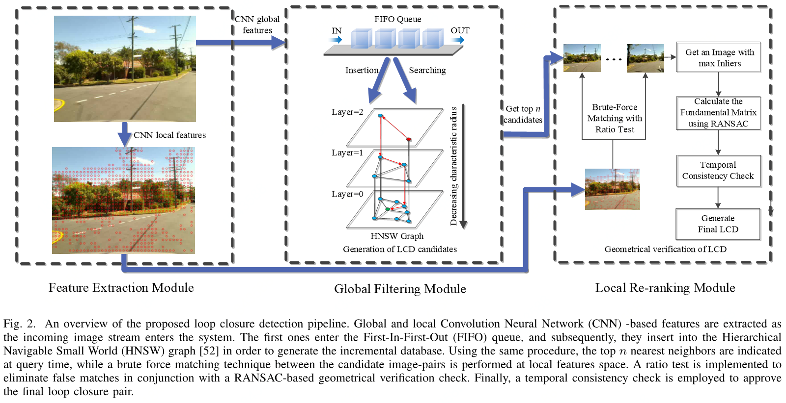

# Fast and Incremental Loop Closure Detection with Deep Features and Proximity Graphs

This is the C++ implementation of our new article:
Shan An, Haogang Zhu, Dong Wei, and Konstantinos A. Tsintotas. Fast and Incremental Loop Closure Detection with Deep Features and Proximity Graphs. Submitted to Transactions on Robotics.

**Abstract:** 
In recent years, methods concerning the place recognition task have been extensively examined from the robotics community within the scope of simultaneous localization and mapping applications.
In this article, an appearance-based loop closure detection pipeline is proposed, entitled ``FILD++" (Fast and Incremental Loop closure Detection).
When the incoming camera observation arrives, global and local visual features are extracted through two passes of a single convolutional neural network.
Subsequently, a modified hierarchical-navigable small-world graph incrementally generates a visual database that represents the robot's traversed path based on the global features.
Given the query sensor measurement, similar locations from the trajectory are retrieved using these representations, while an image-to-image pairing is further evaluated thanks to the spatial information provided by the local features.
Exhaustive experiments on several publicly-available datasets exhibit the system's high performance and low execution time compared to other contemporary state-of-the-art pipelines.

The proposed feature extraction network:


An overview of the proposed loop closure detection method:


The codebase is located in "FILD++" directory.

*** 
*** 

# Fast and Incremental Loop closure Detection using Proximity Graphs

This is the C++ implementation of our IROS 2019 paper:
**Shan An**, Guangfu Che, Fangru Zhou, Xianglong Liu, Xin Ma, Yu Chen. Fast and Incremental Loop Closure Detection using Proximity Graphs. pp. 378-385, The 2019 IEEE/RSJ International Conference on Intelligent Robots and Systems (IROS 2019). 

**Abstract:** Visual loop closure detection, which can be considered as an image retrieval task, is an important problem in SLAM (Simultaneous Localization and Mapping) systems. The frequently used bag-of-words (BoW) models can achieve high precision and moderate recall. However, the requirement for lower time costs and fewer memory costs for mobile robot applications is not well satisfied. In this paper, we propose a novel loop closure detection framework titled `FILD' (Fast and Incremental Loop closure Detection), which focuses on an on-line and incremental graph vocabulary construction for fast loop closure detection. The global and local features of frames are extracted using the Convolutional Neural Networks (CNN) and SURF on the GPU, which guarantee extremely fast extraction speeds. The graph vocabulary construction is based on one type of proximity graph, named Hierarchical Navigable Small World (HNSW) graphs, which is modified to adapt to this specific application. In addition, this process is coupled with a novel strategy for real-time geometrical verification, which only keeps binary hash codes and significantly saves on memory usage. Extensive experiments on several publicly available datasets show that the proposed approach can achieve fairly good recall at 100\% precision compared to other state-of-the-art methods. The source code can be downloaded at https://github.com/AnshanTJU/FILD for further studies.

The codebase is located in "FILD" directory. 

## License
The project is licensed under the New BSD license. It makes use of several third-party libraries:

hnswlib: https://github.com/nmslib/hnswlib

Theia Vision Library: http://theia-sfm.org/

The original hnswlib is head-only. We modify it to a stand-alone dynamic library. 

The Theia Vision Library includes many functions for SFM. We only extract a few functions and make a stand-alone dynamic library. 

## Related Publications
If you find this work useful in your research, please cite:
```
@inproceedings{anshan2019fild,
  title={Fast and Incremental Loop closure Detection using Proximity Graphs},
  author={An, Shan and Che, Guangfu and Zhou, Fangru and Liu, Xianglong and Ma, Xin and Chen, Yu},
  booktitle={Proc. IEEE/RSJ Int. Conf. Intell. Robots Syst.},
  pages={378--385},
  year={2019},
  month={Nov.}}
```
